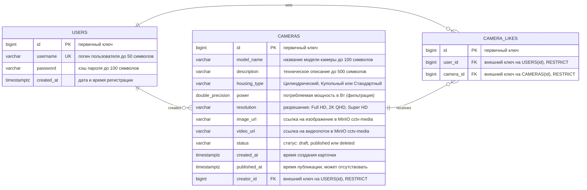

# Лабораторная работа №2

- **Цель работы**: разработка структуры базы данных и её подключение к бэкенду.
- **Порядок показа**: показать панель администратора Adminer, логически удалить команду RISC-V через изменение статуса и посмотреть данные с помощью `SELECT`; показать три страницы приложения, выполнить поиск, удалить команду, проверить недоступность удалённой команды по URL, создать и опубликовать команду с проверкой данных в БД; изменить предметные поля команды и количество лайков в связи многие-ко-многим и показать изменения в приложении; в коде показать модели, пять контроллеров с ORM и логическое удаление через SQL `UPDATE`.
- **Контрольные вопросы**: виды БД, SQL-запросы, курсоры, ORM, модель и миграции, чистая архитектура.
- **ER-диаграмма**: таблицы, связи, столбцы, типы и длины столбцов, первичные и внешние ключи.
- **Задание**: создать базу данных PostgreSQL по предметной области RISC-V и подключить её к трём разработанным шаблонам.

Необходимо разработать и реализовать структуру БД по предметной области RISC-V. Таблица `riscv_commands` используется на страницах приложения и наполняется данными через Adminer.

Получение и серверную фильтрацию команд, создание и публикацию команд через смену статуса необходимо выполнить с помощью ORM. На странице плитки требуется добавить кнопку логического удаления команды: статус меняется на `deleted` параметризованным SQL-запросом `UPDATE` без ORM. Всего в приложении должно быть шесть прикладных HTTP-методов: три `GET`, `POST` создания черновика через ORM, `POST` публикации через ORM и `POST` логического удаления через SQL.

При создании пользователь указывает мнемонику, изображение и видео, затем нажимает кнопку «Далее». Для публикации необходимо заполнить краткое описание, пример команды RISC-V и её параметры, после чего нажать кнопку «Опубликовать». Если у пользователя нет команды в статусе `draft`, она создаётся только после нажатия кнопки «Далее». Если черновик уже существует, страница открывается с заполненными полями и кнопкой «Опубликовать». Команды со статусом `deleted` просматривать нельзя. Добавление лайков во второй лабораторной не требуется — отображается сохранённое в БД количество.

База данных должна содержать три таблицы без каскадного удаления:

- `riscv_commands` — команды RISC-V с мнемоникой, примером команды, кратким описанием, форматом, количеством операндов, длиной команды в битах, статусом `draft`/`published`/`deleted`, ключами изображения и видео в MinIO, датами создания и публикации и ссылкой на создателя;
- `riscv_command_likes` — связь многие-ко-многим между пользователями и командами с первичным и двумя внешними ключами;
- `users` — пользователи приложения.

В БД обязательно должны находиться команды в трёх статусах: `draft`, `published` и `deleted`. У каждого пользователя допускается не более одной команды в статусе `draft`. Названия таблиц и полей должны соответствовать предметной области RISC-V.

## ER-диаграмма

